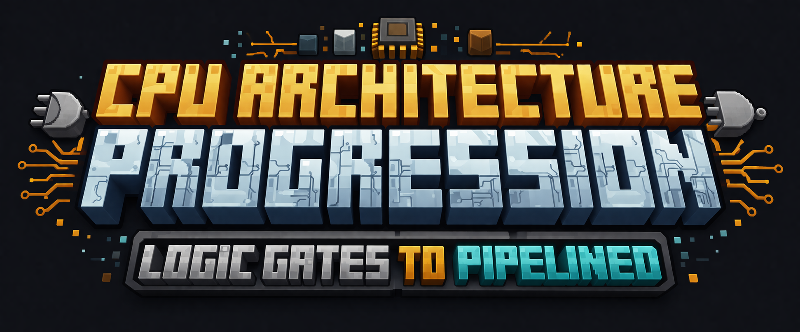

If you want to learn what a processor does, there are plenty of resources that explain instructions, assembly, and performance.

What is harder to find is a clean end-to-end example of how a processor is actually built from the hardware level up.

Most examples are either too abstract to show the real digital design, or too complex to follow from first principles.

This project was built to bridge that gap.

I designed and verified the core hardware building blocks, used them to construct a working single-cycle CPU, and then redesigned that processor into a 5-stage pipelined version.

[TODO: Add a polished visual for a clean architecture progression graphic: Components → Single-Cycle CPU → 5-Stage Pipeline]

## What this project includes

- **Foundational components**  
  Multiplexers, decoders, registers, a register file, and a 64-bit ALU

- **Single-cycle CPU**  
  A complete unpipelined processor built from those components

- **5-stage pipelined CPU**  
  A higher-performance version with hazard-aware execution

- **Design evidence**  
  Diagrams, tests, waveforms, and benchmark results

## At a glance

- Built **solo**
- Core original work includes the **register file** and **64-bit ALU**
- Progression from **components → single-cycle CPU → pipelined CPU**
- Supported by **design diagrams, tests, waveforms, and benchmark results**

## Repository guide

- [`components/`](components/) — foundational hardware blocks
- [`single_cycle_cpu/`](single_cycle_cpu/) — unpipelined CPU
- [`pipelined_cpu/`](pipelined_cpu/) — 5-stage pipelined CPU
- [`results/`](results/) — tests, waveforms, and benchmark summaries
- [`docs/`](docs/) — diagrams and supporting figures

## Selected results

[TODO: Populate this when single-cycle and pipelined are uploaded]

## Design story

### Stage 1 — Components
Built the core hardware blocks that later make up the processor datapath and storage system.

### Stage 2 — Single-Cycle CPU
Integrated the component work into a complete CPU that executes instructions in a single-cycle organization.

### Stage 3 — 5-Stage Pipelined CPU
Redesigned the processor into a pipelined implementation to improve performance while handling control and data hazards correctly.

## Reproducibility

This repository includes the source files, tests, and simulation flow needed to inspect and reproduce the project stages.

[TODO: Link ModelSim tutorial here]

## Acknowledgment

This repository is presented as a polished engineering project.

Originally developed in the context of EE 469 Computer Architecture I.

Some support modules, such as instruction memory and data memory, were provided and are not claimed as original work.
