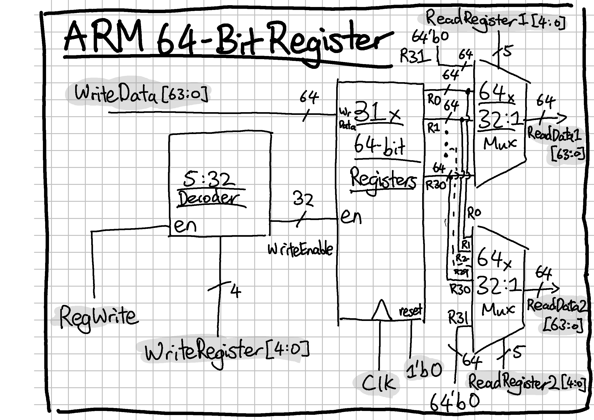
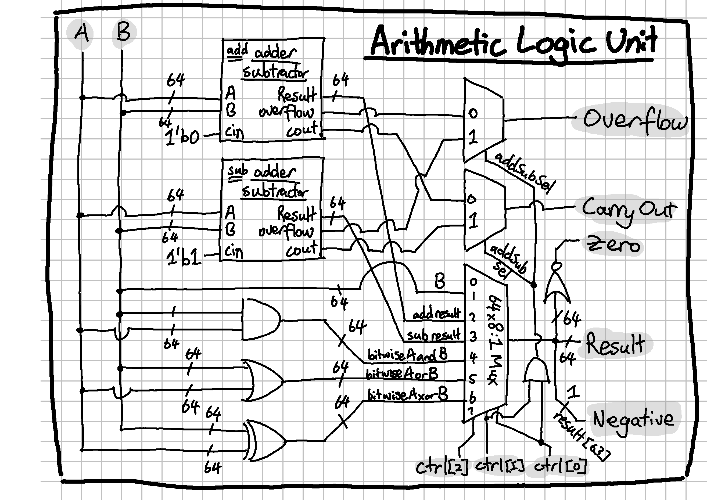

# Stage 1 — Foundational Components

This directory contains the foundational datapath and storage components used in the later CPU implementations.

## Purpose

Before integrating a complete processor, I built and verified the core structures needed for register storage, operand selection, arithmetic/logic computation, and write/read routing.

These components were designed to be reusable in later stages of the project.

## Included components

### Multiplexers
- 2:1 mux
- 4:1 mux
- 8:1 mux
- 16:1 mux
- 32:1 mux
- 64 x 32:1 mux
- 64 x 8:1 mux

### Decoders
- 2:4 decoder with enable
- 3:8 decoder with enable
- 5:32 decoder with enable

### Storage elements
- D flip-flop with enable
- 64-bit register

### Register subsystem
- 32 x 64-bit register file
- 2 read ports
- 1 write port
- decoded write selection

### ALU subsystem
- full adder
- 64-bit add/subtract path
- bitwise AND / OR / XOR units
- ALU result mux
- carry / overflow / zero / negative flags

## Key figures

### Register file

### ALU

## Verification

Component tests check:
- correct selection behavior
- correct one-hot decode behavior
- correct write-enable semantics
- correct multi-port register file behavior
- correct arithmetic and logical ALU outputs
- correct status flag generation

Note: Most of the module level testbenches are included in the same .sv file as the SystemVerilog codes. Only the regfile.sv and alu.sv have their testbenches in a separate file. My workflow involves running the runlab.do and *_wave.do scripts in ModelSim. Read the comments in runlab.do to run different testbenches. 
